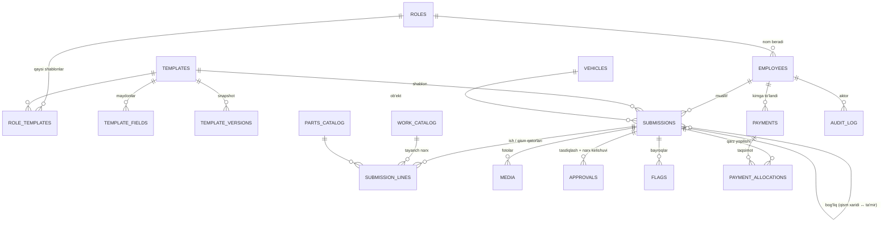

# 02. Ma'lumotlar modeli (ER)

PostgreSQL. Barcha jadvallarda `id BIGSERIAL`, `created_at`, `updated_at`.
Pul — `NUMERIC(14,2)`, valyuta UZS (yagona, ustun kerak emas).
Vaqt — `TIMESTAMPTZ`, saqlash UTC, ko'rsatish `Asia/Tashkent`.

> **Model ataylab kichik:** 150 mashina, 4–5 usta, kuniga 3–5 hisobot.
> Filial, zayavka, ombor va haydovchi qatlamlari **yo'q** — ular bu masshtabda
> ortiqcha murakkablik edi.

## 1. Umumiy ER diagramma



## 2. Rollar va xodimlar

### `roles` — rollar (= **nomlar**)

| Ustun | Tur | Izoh |
|---|---|---|
| `id` | bigserial PK | |
| `code` | text unique | `mechanic`, `supplier`, `admin`, `accountant`, `electrician`… |
| `name_uz`, `name_ru` | text | Menyuda ko'rinadigan nom |
| `icon` | text | Emoji (`🔧`, `📦`, `⚡`) |
| **`kind`** | enum | **`reporter` / `admin` / `accountant`** — ruxsatlar shundan kelib chiqadi |
| `is_system` | bool | Seed rollar o'chirilmaydi |
| `is_active` | bool | |
| `sort` | int | |

> ⚠️ **`permissions` va `role_permissions` jadvallari YO'Q.** Ruxsat `kind`dan
> aniqlanadi — [rol modeli](../01-product/01-roles-and-permissions.md#4-ruxsatlar--soddalashtirilgan).
> Admin cheksiz **nom** yaratadi, lekin **turlar faqat uchta**.

### `role_templates` — rol qaysi shablonlarni ko'radi

```
role_templates(role_id FK, template_id FK, sort)   -- PK(role_id, template_id)
```

### `employees` — xodimlar

| Ustun | Tur | Izoh |
|---|---|---|
| `id` | bigserial PK | |
| `tg_user_id` | bigint unique null | Birinchi kirishda biriktiriladi |
| `tg_username` | text null | |
| `phone` | text unique | `+998XXXXXXXXX` normalizatsiya |
| `full_name` | text | |
| **`role_id`** | FK → roles | **Bitta rol** — model shuni talab qiladi |
| `workshop_name` | text null | Ustaxona nomi (ixtiyoriy, ma'lumot uchun) |
| `workshop_lat`, `workshop_lon` | numeric(9,6) null | Ixtiyoriy |
| `status` | enum | `active` / `blocked` / `fired` |
| `hired_at`, `fired_at` | date null | |
| `lang` | text | `uz` / `ru` |
| `tg_blocked` | bool | Bot bloklangan bo'lsa |
| `settings` | jsonb | Bildirishnoma sozlamalari |

**Indeks:** `tg_user_id`, `phone`, `(role_id, status)`

> **Nima uchun bitta rol:** rol = nom bo'lgani uchun bir odamda ikkita nom
> bo'lishi mantiqsiz. Agar usta ba'zan ta'minotchi ishini ham qilsa — uning
> roliga ikkala shablon biriktiriladi (`role_templates`), yangi rol shart emas.

> ❌ **`branches` jadvali yo'q** — ustalar o'z ustaxonalarida ishlaydi va
> filialga biriktirilmaydi.

## 3. Avtopark

### `vehicles` — mashinalar

| Ustun | Tur | Izoh |
|---|---|---|
| `id` | bigserial PK | |
| `plate_number` | text unique | Normalizatsiya: bo'sh joysiz, katta harf (`01A123BC`) |
| `plate_display` | text | Ko'rsatish uchun (`01 A 123 BC`) |
| `vin` | text null | |
| `brand`, `model` | text | BYD, Chazor |
| `year` | int | |
| `color` | text | |
| `tariff` | enum | `comfort` / `comfort_plus` / boshqa |
| `is_electric` | bool | default true |
| `battery_kwh` | numeric(6,2) null | |
| `battery_soh` | numeric(5,2) null | Holat % (v3) |
| `status` | enum | `active` / `in_service` / `waiting_parts` / `inactive` / `sold` |
| `odometer_km` | int null | Oxirgi ma'lum probeg |
| `odometer_updated_at` | timestamptz null | |
| `fleet_car_id` | text null unique | Yandex Fleet `car.id` |
| `current_driver_name` | text null | **Fleet'dan sinxron** — faqat ma'lumot |
| `current_driver_fleet_id` | text null | Fleet'dan sinxron |
| `notes` | text null | |

**Indeks:** `plate_number` (unique), `status`, `fleet_car_id`

> ❌ **`vehicle_assignments` jadvali yo'q** — haydovchilar tizimda rolga ega
> emas. Joriy haydovchi Fleet'dan sinxronlanadi va faqat ma'lumot sifatida
> ko'rsatiladi.

## 4. Universal hisobot yadrosi

Bu — platformaning markazi. Batafsil: [03-report-templates.md](03-report-templates.md)

### `templates` — hisobot shablonlari

| Ustun | Tur | Izoh |
|---|---|---|
| `id` | bigserial PK | |
| `code` | text unique | `car_repair`, `part_purchase`, `car_wash` |
| `name_uz`, `name_ru` | text | |
| `subject_type` | enum | `none` / `vehicle` / `employee` |
| `has_money` | bool | To'lov varaqasiga kiradimi |
| `negotiable` | bool | Narx kelishuviga tushadimi |
| `field_mapping` | jsonb | Promoted ustunlar bilan bog'lash |
| `icon`, `color` | text | |
| `version` | int | Har nashrda +1 |
| `is_active` | bool | |

### `template_fields` — shablon maydonlari

| Ustun | Tur | Izoh |
|---|---|---|
| `id` | bigserial PK | |
| `template_id` | FK | |
| `code` | text | Shablon ichida unique |
| `label_uz`, `label_ru` | text | |
| `type` | enum | `text`, `number`, `money`, `photo`, `select`, `lines`, … |
| `section` | text null | Qadamga bo'lish (`before`, `work`, `after`) |
| `sort` | int | |
| `is_required` | bool | |
| `options` | jsonb | select variantlari, photo min/max, camera_only, … |
| `validation` | jsonb | min/max, regex, … |
| `visible_if` | jsonb null | Shartli ko'rsatish |

### `template_versions` — nashr etilgan snapshot

```
template_versions(id, template_id FK, version int, schema jsonb, published_at, published_by)
UNIQUE(template_id, version)
```

Eski hisobot **o'z versiyasidagi** sxema bilan ko'rsatiladi.

### `submissions` — hisobotlar

Ta'mir hisoboti, qism xaridi, yuvish — **hammasi shu jadvalda**.

| Ustun | Tur | Izoh |
|---|---|---|
| `id` | bigserial PK | |
| `number` | text unique | `WO-2026-001247` |
| `template_id` | FK | |
| `template_version` | int | Eski hisobot buzilmasin |
| `author_id` | FK → employees | |
| `co_authors` | bigint[] | Hamkor ustalar |
| **`subject_vehicle_id`** | FK → vehicles null | *promoted* |
| `subject_employee_id` | FK → employees null | *promoted* |
| **`related_submission_id`** | FK → submissions null | Qism xaridi ↔ ta'mir bog'lanishi |
| `status` | enum | [holat mashinasi](05-state-machines.md#1-hisobot) |
| **`data`** | jsonb | Barcha maydon qiymatlari |
| **`proposed_labor_amount`** | numeric(14,2) | *promoted* — muallif so'ragan |
| **`labor_amount`** | numeric(14,2) null | *promoted* — **tasdiqlangan** (to'lov asosi) |
| **`parts_amount`** | numeric(14,2) | *promoted* |
| **`total_amount`** | numeric(14,2) | `labor + parts` |
| `price_negotiated` | bool | Narx kamaytirilganmi |
| **`auto_approved`** | bool | ⭐ `admin` muallifi → tizim avtomatik tasdiqlagan (R1a) |
| **`arrived_at`** | timestamptz null | ⭐ "Mashina keldi" tugmasi |
| **`left_at`** | timestamptz null | ⭐ "Mashina ketdi" tugmasi |
| `resolution` | enum null | `repaired` / `no_defect` / `external` |
| `is_external` | bool | Tashqi servisda bajarilgan |
| `submitted_at` | timestamptz null | |
| **`payable_amount`** | numeric(14,2) | ⭐ Qarz asosi: tasdiqlangan ish haqi + o'z hisobidan olingan qismlar. **Serverda** qayta hisoblanadi (P3) |
| **`paid_amount`** | numeric(14,2) | ⭐ To'langani. `CHECK (paid_amount BETWEEN 0 AND payable_amount)` (P2) |
| `geo_lat`, `geo_lon` | numeric(9,6) null | Yuborish joyi (ixtiyoriy) |
| `flags_count` | int | Ro'yxatda tez ko'rsatish |

**Downtime = `left_at − arrived_at`.** Haydovchi bo'lmagani uchun bu ikki
tugma downtime'ning yagona manbai.

**Promoted ustunlar** — shablonning `field_mapping` tavsifiga ko'ra JSONB'dan
ko'chiriladi. Analitika faqat shu ustunlar bilan ishlaydi
([ADR-0002](../05-delivery/03-decisions.md)).

**Indeks:**
```sql
CREATE INDEX ON submissions (status, submitted_at DESC);
CREATE INDEX ON submissions (subject_vehicle_id, submitted_at DESC);
-- qarz ro'yxati: kim, qancha qarz, eng eskisidan (FIFO)
CREATE INDEX ON submissions (author_id, status, submitted_at);
CREATE INDEX ON submissions USING GIN (data jsonb_path_ops);
```

### `submission_lines` — ish va qism qatorlari

| Ustun | Tur | Izoh |
|---|---|---|
| `id` | bigserial PK | |
| `submission_id` | FK | |
| `kind` | enum | `labor` / `part` |
| `catalog_id` | bigint null | `work_catalog` yoki `parts_catalog` |
| `name` | text | Katalogsiz ham kiritish mumkin |
| `qty` | numeric(10,2) | |
| **`proposed_unit_price`** | numeric(14,2) | **Muallif so'ragan** — immutable |
| **`proposed_amount`** | numeric(14,2) | `qty × proposed_unit_price` |
| **`approved_unit_price`** | numeric(14,2) null | **Admin tasdiqlagan** |
| **`approved_amount`** | numeric(14,2) null | To'lov shundan |
| `price_changed_by` | FK → employees null | Kim kamaytirdi |
| `price_change_reason` | text null | Kamaytirishda **majburiy** |
| `mechanic_accepted_at` | timestamptz null | Muallif rozilik bergan vaqt |
| `mechanic_accept_mode` | enum null | `manual` / `auto_48h` |
| `reference_amount` | numeric(14,2) null | Tasdiqlash paytidagi tarixiy o'rtacha (snapshot) |
| `deviation_pct` | numeric(6,2) null | `proposed` vs `reference` |
| `supplier_name` | text null | Qism qatorlari uchun |
| **`self_funded`** | bool | ⭐ «O'z hisobimdan» — faqat `kind='part'` uchun. `true` → narx kiritiladi va **qarzga kiradi**; `false` → narx `0`, qarzga kirmaydi ([ADR-0016](../05-delivery/03-decisions.md#adr-0016--usta-oz-hisobidan-olgan-qism-ham-qarzga-kiradi)) |
| `is_original` | bool null | Original / analog |
| `warranty_days` | int null | |

**`self_funded` cheklovlari:**

```sql
-- kompaniya to'lagan qismda narx bo'lmaydi (P6 — R2 CHECK buzilmasin)
CHECK (kind = 'labor' OR self_funded OR proposed_amount = 0)
```

Belgi **serverda narxdan kelib chiqadi** (R7 — klientga ishonilmaydi):
`self_funded = kind == part AND (belgi qo'yilgan OR narx > 0)`; belgisiz qism
narxi `0` ga tushiriladi. Shu sababli zid holat imkonsiz.

`self_funded = true` bo'lsa — **chek fotosi majburiy** (shablon validatsiyasi).
Ta'minotchining xaridi doim narx bilan kiritilgani uchun avtomatik
`self_funded` bo'ladi → u ham qarzdorlar ro'yxatiga tushadi.

**Narx qoidalari:**

| # | Qoida | Amalga oshirish |
|---|---|---|
| 1 | `proposed_*` — **immutable** | Servis darajasida + audit |
| 2 | **`approved_amount ≤ proposed_amount`** | `CHECK` cheklovi |
| 3 | `approved < proposed` → `price_change_reason` NOT NULL | `CHECK` cheklovi |
| 4 | To'lov varaqasi **faqat `approved_amount`** bilan ishlaydi | |

### `media` — fotolar va fayllar

| Ustun | Tur | Izoh |
|---|---|---|
| `id` | bigserial PK | |
| `submission_id` | FK null | |
| `field_code` | text null | Qaysi maydonga tegishli |
| `kind` | enum | `before` / `problem` / `after` / `receipt` / `odometer` / `other` |
| `storage_key` | text | S3 kalit |
| `tg_file_id` | text null | Telegram kesh (asosiy manba emas) |
| `mime`, `size_bytes`, `width`, `height` | | |
| `sha256` | text | Aynan bir xil faylni aniqlash |
| `phash` | bigint null | O'xshash rasmni aniqlash |
| `exif_taken_at` | timestamptz null | |
| `exif_lat`, `exif_lon` | numeric(9,6) null | |
| `source` | enum | `camera` / `gallery` / `unknown` |
| `uploaded_by` | FK | |
| `uploaded_at` | timestamptz | Server vaqti |
| `deleted_at` | timestamptz null | **Qo'lda** o'chirish (avtomatik arxiv yo'q) |

**Indeks:** `submission_id`, `sha256`, `phash`

### `approvals` — tasdiqlash va kelishuv izi

| Ustun | Tur |
|---|---|
| `id`, `submission_id` FK | |
| `actor_id` | FK → employees **null** — avtomatik tasdiqda `NULL` (tizim) |
| `decision` | enum: `approved` / **`auto_approved`** / `rejected` / `reopened` / `price_proposed` / `price_accepted` / `price_disputed` |
| `line_id` | FK → submission_lines null (narx qarorlarida) |
| `amount_before`, `amount_after` | numeric(14,2) null |
| `comment` | text null (rad/qaytarish/kamaytirishda majburiy) |
| `created_at` | timestamptz |

> Narx kelishuvining **har bir qadami** shu yerda qoladi — nizolarda yagona dalil.

### `flags` — anti-fraud bayroqlari

| Ustun | Tur |
|---|---|
| `id`, `submission_id` FK | |
| `code` | text (`price_above_history`, `duplicate_photo`, `rework`, …) |
| `severity` | enum: `info` / `warning` / `critical` |
| `details` | jsonb |
| `resolved_by` | FK null |
| `resolution` | enum null: `accepted` / `false_positive` / `confirmed_fraud` |
| `resolution_comment` | text null |

## 5. Spravochniklar

### `work_catalog` — ish turlari

| Ustun | Tur | Izoh |
|---|---|---|
| `id`, `code` unique | | `brake_pad_front_replace` |
| `name_uz`, `name_ru`, `category` | text | |
| `reference_price` | numeric(14,2) null | **Tayanch narx — faqat admin ko'radi** |
| `standard_minutes` | int null | |
| `warranty_days` | int null | Rework tekshiruvi uchun |
| `is_active` | bool | |

### `work_price_stats` — narx tarixi (materialized view)

Admin ekranida savdolashuv uchun ko'rsatiladi:

| Ustun | Izoh |
|---|---|
| `catalog_id` | Ish turi |
| `approved_count_90d` | Oxirgi 90 kunda necha marta tasdiqlangan |
| `avg_approved`, `min_approved`, `max_approved` | Narx oralig'i |
| `avg_proposed`, `avg_reduction_pct` | Kelishuv statistikasi |
| `last_approvals` | jsonb: oxirgi 5 ta (xodim, sana, summa) |

### `parts_catalog` — ehtiyot qism katalogi

```
parts_catalog(id, code, name, article, category,
              last_price, avg_price_90d, default_supplier, is_active)
```

⚠️ Bu **ombor emas** — qoldiq hisoblanmaydi (qism omborga tushmaydi).

## 6. To'lov (qarz daftari), audit

> ⚠️ **`periods` va `payouts` jadvallari YO'Q** — olib tashlangan
> ([ADR-0015](../05-delivery/03-decisions.md#adr-0015--qarz-daftari-oy-yopish-orniga-hisobot-boyicha-tolov-)).
> Qarz hisobot darajasida yuritiladi, oylik kesim `submitted_at` bo'yicha
> filtrlanadi.

### `payments` — to'lov yozuvi (daftar boshi)

| Ustun | Tur | Izoh |
|---|---|---|
| `id` | bigint PK | |
| `employee_id` | FK → employees | **Kimga** to'landi |
| `amount` | numeric(14,2) | Jami summa, `> 0` |
| `actor_id` | FK → employees | Kim kiritdi (buxgalter/admin) |
| `note` | text null | Izoh (ixtiyoriy) |
| `created_at` | timestamptz | |
| `voided_at` | timestamptz null | Bekor qilingan bo'lsa |
| `voided_by` | FK → employees null | |
| `void_reason` | text null | **Bekor qilinsa majburiy** (P5) |

To'lov **tahrirlanmaydi** — faqat `void` qilinadi.

### `payment_allocations` — to'lov qaysi hisobotlarga tushdi

| Ustun | Tur | Izoh |
|---|---|---|
| `id` | bigint PK | |
| `payment_id` | FK → payments (CASCADE) | |
| `submission_id` | FK → submissions | |
| `amount` | numeric(14,2) | `> 0` (`CHECK`) |

```sql
CREATE INDEX ON payment_allocations (submission_id);
CREATE INDEX ON payments (employee_id, created_at DESC);
```

**P4:** `sum(allocations.amount) == payments.amount` — serverda tekshiriladi.
`void` qilinganda allokatsiyalar saqlanadi (tarix), lekin
`submissions.paid_amount` qayta hisoblanadi.

### `audit_log`

```
audit_log(id, actor_id, action, entity_type, entity_id,
          before jsonb, after jsonb, ip, tg_user_id, created_at)
```

**Hech qachon o'chirilmaydi va tahrirlanmaydi.**

### `notifications` — chiquvchi navbat (outbox)

```
notifications(id, employee_id, template_code, payload jsonb,
              status enum(pending|sent|failed), attempts, last_error, sent_at,
              broadcast_id FK → broadcasts null)
```

Redis navbatsiz ishlaydi: oddiy `SELECT … FOR UPDATE SKIP LOCKED` sikli yetadi
(kuniga ~50 xabar).

**Indeks:** `broadcast_id` — e'lon kartochkasida yetkazish hisobi shu ustun
bo'yicha sanaladi.

### `broadcasts` — e'lonlar

Admin barcha xodimlarga yuborgan xabar. Bitta e'lon → har bir qabul qiluvchiga
bitta `notifications` yozuvi ([admin oqimi §8](../01-product/03-admin-flow.md#8-elon-broadcast)).

| Ustun | Tur | Izoh |
|---|---|---|
| `id` | bigserial PK | |
| `author_id` | FK → employees | Yuborgan admin (`role.kind = 'admin'`) |
| `body` | text | **Xom matn** — HTML escape qilinmagan holda saqlanadi |
| `recipients_total` | int | Navbatga qo'yilgan xodimlar soni (default 0) |
| `created_at` | timestamptz | |

> **Nima uchun xom matn:** escape yuborish payti, `notify_broadcast`ni
> render qilishda qo'llanadi. Bazada `<` belgisi `&lt;` bo'lib qolsa, Mini App
> tarixida e'lon buzilgan ko'rinardi
> ([HTML escape](../03-integrations/02-telegram-bot-miniapp.md#elon-broadcast-yetkazish)).

> ⚠️ **E'lon o'chirilmaydi** — soft delete ham yo'q (R9). Kim, qachon, nima
> yozgani doimiy tarix bo'lib qoladi; `audit_log`da `broadcast_sent` yozuvi.

## 7. Yaxlitlik qoidalari

| # | Qoida | Amalga oshirish |
|---|---|---|
| 1 | `approver_id ≠ author_id` (qo'lda tasdiqlashda) | Servis darajasida (R1) |
| 1a | `admin` muallifi → `auto_approved = true`, `approved = proposed` | Servis darajasida (R1a) |
| 2 | `approved_amount ≤ proposed_amount` | `CHECK` |
| 3 | `approved < proposed` → sabab NOT NULL | `CHECK` |
| 4 | Yopilgan davrga yozuv yo'q | Servis + trigger |
| 5 | `total_amount = labor_amount + parts_amount` | Generated column / trigger |
| 6 | `plate_number` normalizatsiya | Trigger (`upper(regexp_replace(...))`) |
| 7 | Kamida bitta `kind='admin'` rolli faol xodim | Servis darajasida (R8) |
| 8 | O'chirish yo'q — `deleted_at` (soft delete) | Barcha asosiy jadvallarda |

## 8. Hajm baholari (3 yil)

Kuniga 3–5 hisobot ≈ oyiga ~120, yiliga ~1 400.

| Jadval | Yozuvlar |
|---|---|
| `submissions` | ~4 500 |
| `submission_lines` | ~15 000 |
| `media` | ~35 000 |
| `approvals` | ~12 000 |
| `audit_log` | ~150 000 |
| Media hajmi | **~6–10 GB** |

> Bu — **juda kichik baza**. Optimizatsiya emas, to'g'ri model va nazorat muhim.

---

**Keyingi:** [03. Hisobot shablonlari](03-report-templates.md)
