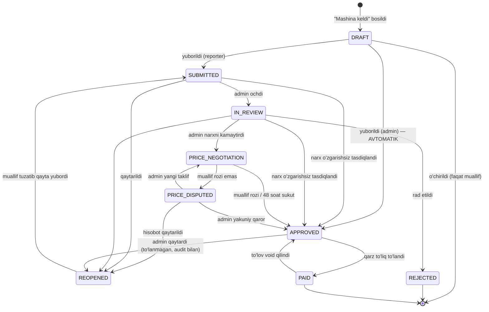
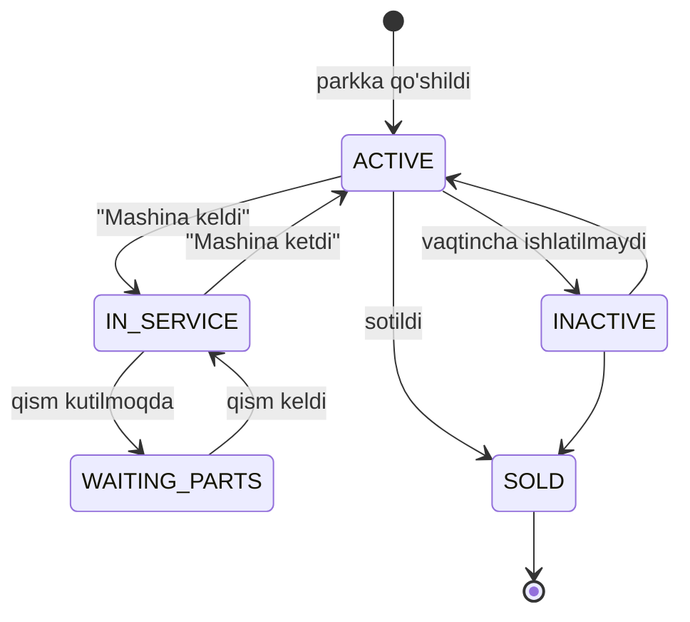
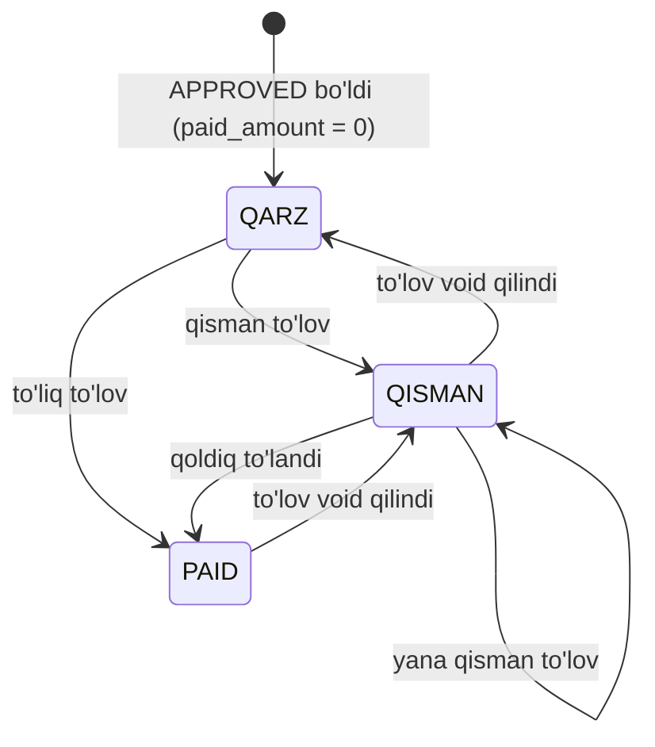
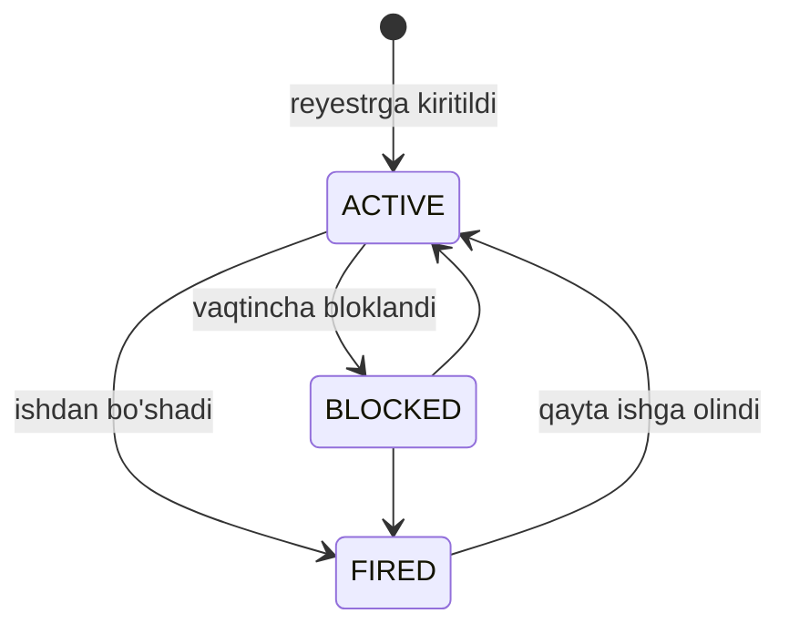
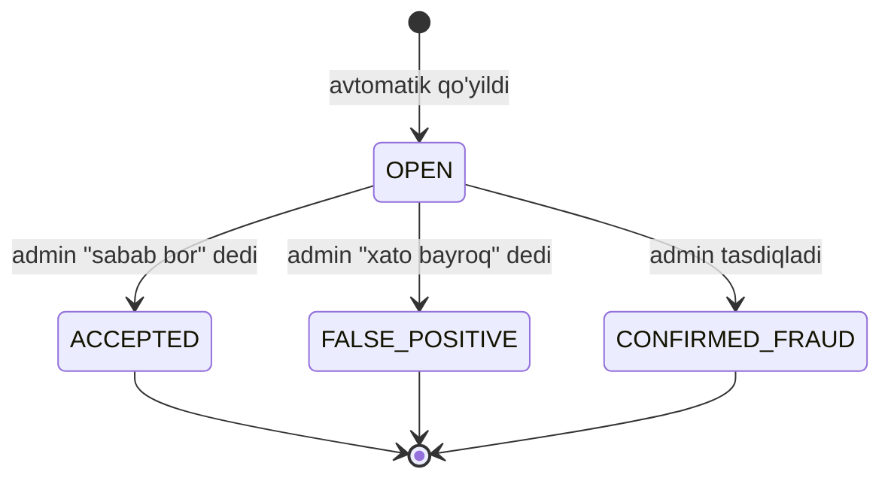

# 05. Holat mashinalari

Har holat o'zgarishi: **kim** qila oladi, **qachon** mumkin, **nima** sodir bo'ladi.
O'tishlar serverda tekshiriladi; ruxsatsiz o'tish → `409 invalid_state_transition`.

Tizimda **uchta** holat mashinasi bor: hisobot, mashina, davr.
(Zayavka va qism so'rovi mashinalari **yo'q** — ular alohida ob'ekt emas.)

## 1. Hisobot (`submissions`)



| Holat | Kim o'zgartira oladi | Tahrirlash | To'lovga kiradi |
|---|---|---|---|
| `DRAFT` | Muallif | ✅ | ❌ |
| `SUBMITTED` | — | ❌ | ❌ |
| `IN_REVIEW` | Admin | faqat narx | ❌ |
| **`PRICE_NEGOTIATION`** | **Muallif (rozilik)** | ❌ | ❌ |
| **`PRICE_DISPUTED`** | Admin | faqat narx | ❌ |
| `REOPENED` | Muallif | ✅ | ❌ |
| `APPROVED` | — | ❌ | ✅ |
| `REJECTED` | — | ❌ | ❌ |
| `PAID` | — | ❌ | ✅ (yopilgan) |

### O'tish qoidalari

| O'tish | Kim | Shartlar | Yon ta'sirlar |
|---|---|---|---|
| `→ DRAFT` | Muallif | — | `arrived_at = now()`, mashina `in_service` |
| `DRAFT → SUBMITTED` | Muallif (`reporter`) | Validatsiya o'tdi, `left_at` to'ldirilgan | Bayroq hisoblash, adminga bildirishnoma, `proposed_*` qulflanadi |
| **`DRAFT → APPROVED`** ⭐ | Muallif (`admin`) | Shu shartlar | **Avtomatik tasdiq (R1a):** `approved = proposed`, `auto_approved = true`, `approvals(decision='auto_approved', actor_id=NULL)`. Bildirishnoma yo'q, kelishuv yo'q |
| `SUBMITTED → IN_REVIEW` | Admin | Ruxsat bor | "Ko'rilmoqda" belgisi |
| `→ APPROVED` (narx o'zgarishsiz) | Admin | **R1: `approver ≠ author`** | `approved = proposed`, `payable_amount` hisoblanadi (R5), `approvals`, muallifga bildirishnoma |
| **`IN_REVIEW → PRICE_NEGOTIATION`** | Admin | `new < proposed`, **sabab majburiy** | `approvals(price_proposed)`, bildirishnoma, 48 soatlik taymer |
| **`PRICE_NEGOTIATION → APPROVED`** | Muallif yoki tizim | Rozilik yoki 48 soat sukut | `mechanic_accept_mode = manual / auto_48h` |
| **`PRICE_NEGOTIATION → PRICE_DISPUTED`** | Muallif | Izoh majburiy | Adminga bildirishnoma |
| **`PRICE_DISPUTED → APPROVED`** | Admin | **Yakuniy qaror adminda**, izoh majburiy | Muallifga bildirishnoma |
| `→ REOPENED` | Admin | Izoh majburiy | Tahrirlash ochiladi |
| `→ REJECTED` | Admin | Izoh majburiy | To'lovdan chiqadi |
| `APPROVED → PAID` | Tizim | `paid_amount == payable_amount` | To'lov qayd etilganda avtomatik |
| `PAID → APPROVED` | Tizim | To'lov `void` qilindi | `paid_amount` qayta hisoblanadi, qarz qayta ochiladi |
| `APPROVED → REOPENED` | Admin | **To'lanmagan** (`paid_amount = 0`), sabab majburiy | Audit log |

> ❗ **Qattiq cheklovlar:**
> - `approved_amount ≤ proposed_amount` — admin narxni **oshira olmaydi** (R2)
> - `approver_id ≠ author_id` — hech kim o'z hisobotini **qo'lda** tasdiqlay
>   olmaydi (R1)
> - **`admin` muallifi bo'lgan hisobot tizim tomonidan avtomatik tasdiqlanadi**
>   (R1a) — u `SUBMITTED` / `PRICE_NEGOTIATION` holatlariga umuman kirmaydi

### `arrived_at` / `left_at`

Haydovchi bo'lmagani uchun mashinaning kelgani va ketgani ustaning ikki
tugmasi orqali qayd etiladi:

```
[ 🚗 Mashina keldi ]  → arrived_at = SERVER vaqti, mashina → in_service
   ... ish ...
[ 🚙 Mashina ketdi ]  → left_at = SERVER vaqti, mashina → active
```

- Vaqt **serverda** yoziladi — klient yuborgan qiymatga ishonilmaydi
- `left_at` to'ldirilmasa hisobot yuborilmaydi
- **Downtime = `left_at − arrived_at`**
- `left_at < arrived_at` → `422 business_rule_violated`

## 2. Mashina (`vehicles.status`)



**Yandex Fleet bilan bog'liqlik** (Faza 3):

| Platforma statusi | Fleet `car.status` |
|---|---|
| `ACTIVE` | `working` |
| `IN_SERVICE` / `WAITING_PARTS` | `repairing` |
| `INACTIVE` | `not_working` |

> ⚠️ **2026-08-01 dan bu jadval faqat ma'lumot uchun** — platforma Fleet'ga
> status yozmaydi ([Fleet §6](../03-integrations/01-yandex-fleet-api.md)).
> Avvalgi g'oya: ta'mir boshlanganda mashinani Fleet'da `repairing` qilish zakaz kelmasligini
> ta'minlaydi — [Fleet integratsiyasi](../03-integrations/01-yandex-fleet-api.md).

## 3. Qarz va to'lov

> ⚠️ **Davr (`periods`) holat mashinasi YO'Q** — oy yopish tushunchasi olib
> tashlangan ([ADR-0015](../05-delivery/03-decisions.md#adr-0015--qarz-daftari-oy-yopish-orniga-hisobot-boyicha-tolov-)).

Qarz — alohida holat emas, hisobotning **hisoblanadigan xususiyati**:



| Ko'rinish | Shart |
|---|---|
| **Qarz** | `status = APPROVED` va `paid_amount < payable_amount` |
| **Qisman** | `0 < paid_amount < payable_amount` — «Qarzlar» tabida qoldiq bilan |
| **To'langan** | `paid_amount == payable_amount` → `status = PAID` |

⭐ **«Qisman» endi Mini App'da ham ko'rinadi** (2026-08-04): hisobot belgisi
`Tasdiqlangan → Qisman to'langan → To'langan` bo'lib o'zgaradi va kartochkada
«To'lanadi · To'langan · Qoldi» qatorlari turadi.

⚠️ Bu **ko'rsatish holati** — bazada `partly_paid` statusi YO'Q va qo'shilmaydi.
Holat mashinasi o'zgarmagan: `status` qisman to'lov davrida hamon `APPROVED`.
Farq `paid_amount`/`payable_amount` dan hisoblanadi (`miniapp/src/display-status.ts`,
testi bor). Yangi status kiritilsa migratsiya, `_sync_status` va barcha
filtrlar buzilardi — foyda esa faqat ko'rinishda edi.

To'lovning o'zi ikki holatda: **faol** yoki **`void`** (bekor qilingan, sabab
majburiy). To'lov hech qachon tahrirlanmaydi — faqat `void` (P5).

## 4. Xodim (`employees.status`)



**Hech qachon o'chirilmaydi** — eski hisobotlar baribir kerak.
⚠️ Oxirgi `kind='admin'` xodimni bloklash/bo'shatish taqiqlanadi (R8).

## 5. Bayroq (`flags`)



`FALSE_POSITIVE` statistikasi anti-fraud chegaralarini sozlash uchun ishlatiladi.

---

**Keyingi:** [06. Xavfsizlik](06-security.md)
