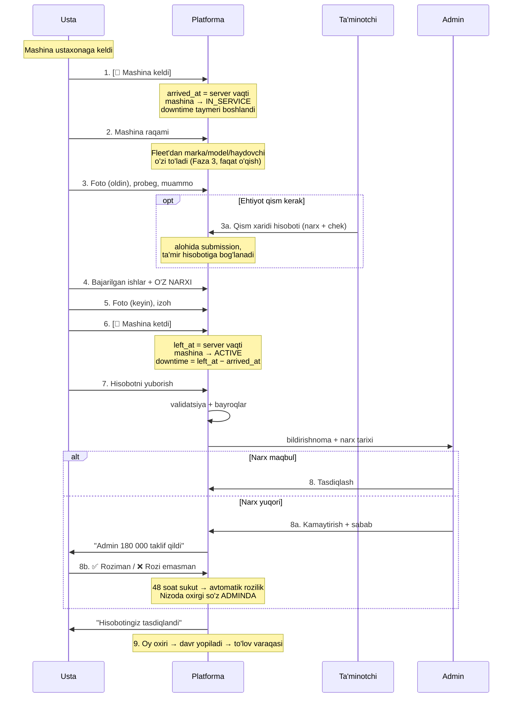

# 01. Ta'mir hayotiy sikli

Mashina ustaxonaga kelganidan to'lovgacha bo'lgan to'liq oqim.

## 1. To'liq oqim



> 📌 **MVP (Faza 1):** ta'minotchi qadami (3a) yo'q — usta qismni narxsiz
> ro'yxatga oladi, narxni admin kiritadi.

## 2. Vaqt belgilari

| # | Bosqich | Vaqt belgisi | Kim | Nima o'lchanadi |
|---|---|---|---|---|
| 1 | Mashina keldi | `submission.arrived_at` | Usta | **Downtime boshlanishi** |
| 6 | Mashina ketdi | `submission.left_at` | Usta | **Downtime tugashi** |
| 7 | Hisobot yuborildi | `submission.submitted_at` | Usta | Hujjatlashtirish kechikishi |
| 8a | Narx taklif qilindi | `approvals(price_proposed)` | Admin | Admin reaksiyasi |
| 8b | Narx kelishildi | `line.mechanic_accepted_at` | Usta | Kelishuv vaqti |
| 8 | Tasdiqlandi | `approvals(approved)` | Admin | Tasdiqlash vaqti |
| 9 | To'landi | `period.closed_at` | Admin / buxgalter | |

Bu vaqt belgilari butun analitikaning asosi:
- **Downtime** = (6) − (1)
- Hujjatlashtirish kechikishi = (7) − (6)
- Admin reaksiyasi = (8) − (7)
- Kelishuv davomiyligi = (8b) − (8a)

⚠️ **Vaqtlar serverda yoziladi** — usta tugmani bosgan lahza qayd etiladi,
klient yuborgan qiymatga ishonilmaydi.

## 3. Downtime — asosiy metrika

Maoshli haydovchi modelida mashina turgan har soat **ikki tomonlama zarar**:
daromad yo'q, lekin maosh ketmoqda.

```
Downtime sabablari:
├── Ish bajarilmoqda           ← normal, minimallashtirish kerak
├── Ehtiyot qism kutilmoqda    ← ⚠️ ta'minot muammosi
├── Usta band                  ← ⚠️ resurs muammosi
└── Mashina olib ketilmadi     ← ⚠️ tashkiliy
```

**Hisobot misoli:**

| Mashina | Downtime (soat) | Ta'mirlar | Xarajat |
|---|---|---|---|
| 01 A 123 BC | 47 | 3 | 2 300 000 🔴 |
| 01 B 456 CD | 12 | 1 | 500 000 |

⚠️ Sabablarga ajratish MVP'da **yo'q** — faqat umumiy downtime o'lchanadi.
Sabab ajratish uchun mashina `WAITING_PARTS` statusi ishlatiladi (Faza 2+).

## 4. Real hayotdagi variantlar

Tizim ularni ham qabul qilishi kerak, aks holda odamlar tizimdan chetlab o'tadi.

### Diagnostika (nosozlik topilmadi)
```
Usta tekshirdi, muammo yo'q
   ↓
resolution = no_defect, ish haqi = diagnostika narxi yoki 0
```
Bu ham qimmatli ma'lumot: qaysi mashina bo'yicha tez-tez "yo'q muammo" chiqadi.

### Tashqi servis
```
Ish parkda bajarilmaydi (masalan kuzov ta'miri)
   ↓
is_external = true, kontragent nomi, ish haqi = 0
   ↓
Hujjat/chek fotosi majburiy
```

### Ish bir necha kun davom etadi
```
arrived_at = 29.07 09:00
left_at    = 31.07 15:00
   ↓
Downtime = 54 soat (hisobot bitta, qoralamada turadi)
```

### Ikki usta birga ishladi
```
co_authors[] — ish haqi alohida qatorlarga yoziladi
Har qaysi usta o'z qatori bo'yicha to'lov oladi
```

## 5. Tasdiqlash oqimi

**Bitta bosqich** — direktorga ko'tarish yo'q ([A-15](../05-delivery/02-open-questions.md)):

```
SUBMITTED → admin ko'radi
              ├─ narx maqbul → APPROVED
              └─ narx yuqori → PRICE_NEGOTIATION
                                  ├─ usta rozi → APPROVED
                                  ├─ 48 soat sukut → APPROVED
                                  └─ usta rozi emas → PRICE_DISPUTED
                                                        → admin yakuniy qaror
```

To'liq mexanizm: [04-price-negotiation.md](04-price-negotiation.md)

⚠️ **Admin hisoboti bu oqimga kirmaydi:** u `DRAFT → APPROVED` to'g'ridan-to'g'ri
o'tadi (`auto_approved = true`), tasdiqlash va kelishuv bosqichlarisiz
([A-25](../05-delivery/02-open-questions.md), R1a).

## 6. Rework (qayta ta'mir) — Faza 3

```
Yangi hisobot yuborildi
        ↓
Shu mashinada + shu kategoriyada oxirgi 30 kunda (yoki kafolat muddatida)
tasdiqlangan hisobot bormi?
        ↓ ha
🚩 rework bayrog'i → admin ko'radi
```

Ustaning `rework_rate` — uning eng muhim sifat ko'rsatkichi.

## 7. Planli texnik ko'rik (TO) — Faza 4

```
Mashina probegi TO chegarasiga yetdi (masalan har 15 000 km)
        ↓
Tizim adminga eslatma yuboradi
        ↓
Usta TO shabloni bo'yicha checklist bilan ishlaydi
```

EV uchun TO ro'yxati odatiy mashinadan farq qiladi:
- ❌ Moy, filtrlar, svechalar — **yo'q**
- ✅ Tormoz suyuqligi, salon filtri, shina, podveska, konditsioner
- ✅ **Batareya holati (SOH)**, zaryadlash porti, termoregulyatsiya
- ⚠️ Tormoz kolodkalari EV'da kamroq yeyiladi (rekuperatsiya), lekin
  **zanglashi mumkin** — boshqa turdagi nazorat

---

**Keyingi:** [02. Firibgarlikka qarshi nazorat](02-antifraud.md)
