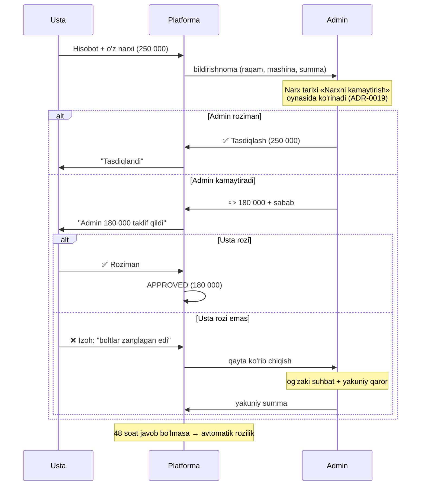

# 04. Narx kelishuvi (usta ↔ admin)

> Bu — NovaCore'ning **asosiy nazorat mexanizmi**. Usta har ish uchun to'lov oladi
> va **narxni o'zi belgilaydi**; admin uni ko'rib chiqadi va kamaytirishi mumkin.
> Ya'ni tizim shunchaki hisobot yig'maydi — u **savdolashuvni raqamlashtiradi**.

## 1. Muammoning mohiyati

```
Usta:  "Bu ish 250 000 so'm turadi"
Admin: "Ko'p, 180 000 ga kelishaylik"
Usta:  "Mayli"
```

Bugun bu suhbat **og'zaki** ketadi va hech qayerda qolmaydi. Natijada:

| Muammo | Oqibati |
|---|---|
| Kim qancha so'ragani yozilmaydi | Doim ko'p so'raydigan usta bilinmaydi |
| Kim qancha tasdiqlagani yozilmaydi | Nizolar: "men 180 dedim", "yo'q, 200 dedingiz" |
| Kelishuv qancha tejaganini bilib bo'lmaydi | Platformaning foydasi ko'rinmaydi |
| Oldingi narxlar esda qolmaydi | Admin har safar noldan savdolashadi |
| Har admin har xil kelishadi | Bir xil ish har xil narxda |

## 2. Yechim: har narx uch xil qiymatga ega

| Qiymat | Kim qo'yadi | O'zgaradimi |
|---|---|---|
| **`proposed_amount`** — usta so'ragan | Usta | ❌ Hech qachon o'zgarmaydi |
| **`approved_amount`** — admin tasdiqlagan | Admin | ✅ Kelishuv jarayonida |
| **`reference_amount`** — tarixiy tayanch | Tizim (avtomatik) | Har tasdiqdan keyin yangilanadi |

`proposed_amount` **hech qachon ustidan yozilmaydi** — bu statistikaning asosi.
To'lov esa doim `approved_amount` bo'yicha hisoblanadi.

## 3. Oqim



## 4. Admin ekrani — savdolashuv uchun ma'lumot

Admin narxni "shunchaki his-tuyg'u bilan" emas, **raqamga tayanib** kamaytirishi kerak:

```
┌──────────────────────────────────────────────────────┐
│  Ish varaqasi #WO-1247 · Karimov B.                  │
├──────────────────────────────────────────────────────┤
│  🔧 Old tormoz kolodkasini almashtirish              │
│                                                       │
│     Usta so'radi:            250 000 so'm            │
│                                                       │
│     📊 Tarix (oxirgi 8 marta):                       │
│        o'rtacha  175 000                              │
│        eng past  150 000  (Yusupov, 12.06)           │
│        eng yuqori 210 000  (Karimov, 03.07)  🟡      │
│                                                       │
│     👤 Karimov B. o'rtachasi:  205 000  (+17%) 🟡    │
│     📉 Uning narxi 42% hollarda kamaytirilgan        │
│                                                       │
│     [ ✅ 250 000 ni tasdiqlash ]                      │
│     [ ✏️ Boshqa summa: ______ ]                       │
│         Tez tanlov: [175 000] [200 000] [210 000]    │
├──────────────────────────────────────────────────────┤
│  Usta izohi: "Boltlar zanglagan, kesib olindi"       │
└──────────────────────────────────────────────────────┘
```

**Eng qimmatli element — tarixiy statistika.** Admin "bu ish odatda 175 000 ga
bo'lgan" deb aytishi mumkin bo'lsa, savdolashuv teng sharoitda ketadi va
kelishuv tez bo'ladi.

## 5. Usta tayanch narxni ko'radimi?

📌 Dizayn qarori — [ADR-0009](../05-delivery/03-decisions.md#adr-0009--narx-kelishuvi-usta--admin).

| Variant | Natija |
|---|---|
| **Ko'rsatilmaydi** (v1 tavsiya) | Usta o'z narxini erkin qo'yadi → real bozor narxi ko'rinadi, kamaytirish imkoni saqlanadi |
| Ko'rsatiladi | Narxlar tayanchga yopishadi → savdolashuv kamayadi, lekin arzonlashtirish imkoni ham yo'qoladi |

**v1: ko'rsatilmaydi.** 2–3 oydan keyin statistikaga qarab qayta ko'riladi —
agar kelishuvlarning 80%i bir xil natija bersa, tayanchni ochiq qilib
vaqt tejash mumkin.

## 6. Nima o'lchanadi

### Xodimning "narx xulqi"

> ⭐ Xodim **o'zining** shu statistikasini ko'radi
> ([A-24](../05-delivery/02-open-questions.md)) — bu o'z-o'zini tuzatishga
> undaydi. Boshqalarnikini ko'rmaydi.

| Metrika | Ma'nosi |
|---|---|
| `avg_proposed` | O'rtacha so'ragan summa |
| `avg_approved` | O'rtacha tasdiqlangan summa |
| **`reduction_rate`** | Necha % hollarda narxi kamaytirilgan |
| **`avg_reduction_pct`** | O'rtacha necha % kamaytirilgan |
| `dispute_rate` | Necha % hollarda kelishmagan |

Agar ustaning `avg_reduction_pct` = 5% bo'lsa — u halol narx qo'yadi.
Agar 35% bo'lsa — u har safar "havoga" so'raydi va admin vaqtini yeyapti.
Bu — suhbat uchun aniq raqam.

### Platformaning o'z KPI'si — tejamkorlik

> ⚠️ **Bu jadval ekranda YO'Q** (ADR-0019, 2026-08-04). Hisob-kitob va
> `GET /reports/negotiation-savings` qoladi, lekin Mini App'da ko'rsatilmaydi:
> savdolashish ko'rsatkichi ilovaning mavzusiga aylanib ketgandi.

```
┌────────────────────────────────────────────┐
│  Iyul 2026 — narx kelishuvi                │
├────────────────────────────────────────────┤
│  Ustalar so'radi:          11 200 000 so'm │
│  Tasdiqlandi:               9 350 000 so'm │
│  ────────────────────────────────────────  │
│  💰 TEJALDI:                1 850 000 so'm │
│                                    (16.5%) │
├────────────────────────────────────────────┤
│  Kelishuvlar soni:              38 / 84    │
│  O'rtacha kamaytirish:              19%    │
│  Nizolar:                        3 (3.6%)  │
└────────────────────────────────────────────┘
```

> Bu jadval — platformaning **o'zini oqlashi**. "Tizim bu oyda 1.85 mln so'm
> tejadi" degan gap loyihani rahbariyat oldida himoya qiladi.

## 7. Ehtiyot qism narxi — bu yerga kirmaydi

Muhim ajratma:

| Nima | Kim narxni qo'yadi | Kelishuv bormi |
|---|---|---|
| **Ish haqi** (usta mehnati) | Usta | ✅ Ha |
| **Ehtiyot qism** | Ta'minotchi (chek bilan) | ❌ Yo'q — chek bo'yicha fakt |

Usta qism narxiga umuman tegmaydi — bu **vazifalarni ajratish** (separation of
duties) prinsipi va F5 (qism narxini shishirish) teshigini butunlay yopadi.
Batafsil: [ta'minotchi oqimi](../01-product/05-supplier-role.md)

## 8. Qoidalar

| # | Qoida | Sabab |
|---|---|---|
| N1 | `proposed_amount` hech qachon o'zgarmaydi | Statistika asosi |
| N2 | Narx kamaytirilsa — **sabab majburiy** | Usta nima uchunligini bilishi kerak |
| N3 | Usta rozilik bermasa — admin qayta ko'radi (avtomatik rad emas) | Adolat |
| N4 | 48 soat javob bo'lmasa — avtomatik rozilik | To'lov qotib qolmasin |
| N5 | Admin narxni **oshira olmaydi** | Til biriktirish oldini olish |
| N6 | Kelishuvning har qadami `audit_log`da | Nizolar uchun dalil |
| N7 | To'lov qayd etilgach narx o'zgarmaydi | Buxgalteriya |
| N8 | Admin hisoboti **kelishuvga umuman kirmaydi** — u avtomatik tasdiqlanadi (`approved = proposed`) | R1a; kelishadigan ikkinchi tomon yo'q |
| N9 | **Tayanch narx `reporter` roliga API'da ham qaytarilmaydi** | Klientda yashirish yetarli emas |

> **N5 haqida:** admin narxni oshirishi mumkin bo'lsa, admin + usta til biriktirib
> summani ko'tarishi mumkin. Shuning uchun faqat kamaytirish. Agar usta juda kam
> so'ragan bo'lsa (xato) — hisobot qaytariladi (`REOPENED`), usta o'zi tuzatadi.

## 9. Bitta bosqich — direktorga ko'tarish yo'q

Kelishuv **faqat admin** bilan bo'ladi. Summaga qarab yuqori rahbarga
ko'tarish mexanizmi **yo'q** ([A-15](../05-delivery/02-open-questions.md)).

Nizoda **oxirgi so'z adminda** ([A-23](../05-delivery/02-open-questions.md)):
usta rozi bo'lmasa admin qayta ko'radi (odatda og'zaki suhbatdan keyin) va
yakuniy summani belgilaydi. Usta baribir rozi bo'lmasa — hisobot `REOPENED`
qilinadi.

⚠️ **Adminning o'z hisoboti kelishuvga kirmaydi:** u **avtomatik tasdiqlanadi**
(`approved = proposed`, `auto_approved = true`) — kelishadigan ikkinchi tomon
mavjud emas ([A-25](../05-delivery/02-open-questions.md), R1a). Bunday
hisobotlar oylik hisobotda **alohida satr** sifatida ko'rsatiladi.

---

**Keyingi:** [05-delivery/01-roadmap.md](../05-delivery/01-roadmap.md)
